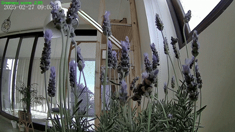

# SoylentGreen - WIP

Tools for creating timelapse videos from surveillance footage, with a focus on Aqara security cameras.

(or how we discovered that a plant can be killed by the sun)




## Overview

SoylentGreen is a Python package that provides tools to work with surveillance camera footage, particularly from Aqara security cameras. It allows you to:

- Create timelapses from surveillance footage
- View videos within Jupyter notebooks
- Process and analyze video frames
- Apply intelligent filtering based on color analysis
- Organize and manage video clips from multiple cameras

## Installation

This project uses Poetry for dependency management. To install:

```bash
# Clone the repository
git clone <repository-url>
cd soylentgreen

# Install with Poetry
poetry install
```

## Dependencies

- Python 3.12+
- OpenCV
- FFmpeg
- NumPy
- Joblib

## Usage

### Creating Timelapses

```bash
# Basic timelapse from a camera directory
timelapse /path/to/aqara_video/lumi1.54ef44457bc9 --output output.mp4

# Timelapse for a specific date range
timelapse /path/to/aqara_video/lumi1.54ef44457bc9 --date-from 20250301-000000 --date-to 20250301-235959 --output output.mp4

# Timelapse for a specific day with green filtering (for plants/gardens)
timelapse /path/to/camera/aqara_video/lumi1.54ef44457bc9 --day 20250301 --green-threshold 0.3 --output output.mp4
```

### Using in Jupyter Notebooks
The JupyterViewer widget shows a list of videos recorded per day.

```python
from aqara_video.viewers.jupyter_viewer import JupyterViewer

# Create and display a viewer for browsing camera footage
viewer = JupyterViewer.create_from_path("/path/to/camera/directory")
```


### Video Analysis

```python
from pathlib import Path
from aqara_video.core.factory import TimelineFactory
from aqara_video.core.video_reader import VideoReader

# Create a timeline of clips from a camera
timeline = TimelineFactory.create_timeline(Path("/path/to/camera/directory"))

# Read the first frame from a video file
video = VideoReader(Path("/path/to/video.mp4"))
frame = video.read_frame()
```

## Project Structure

- `aqara_video/`: Main package
  - `cli/`: Command-line tools
    - `timelapse.py`: Create timelapse videos
    - `video_loop.py`: Real-time video processing
  - `core/`: Core functionality
    - `clip.py`: Video clip representation
    - `factory.py`: Factory for creating timelines
    - `timeline.py`: Timeline representation
    - `video_reader.py`: Low-level video reading tools
  - `providers/`: Camera providers
    - `aqara.py`: Support for Aqara cameras
  - `viewers/`: Video viewers
    - `jupyter_viewer.py`: Jupyter notebook integration

## Examples

Check the `examples/` directory for Jupyter notebooks and Python scripts demonstrating usage.

## License

[License information]

## Author

Diego Caro